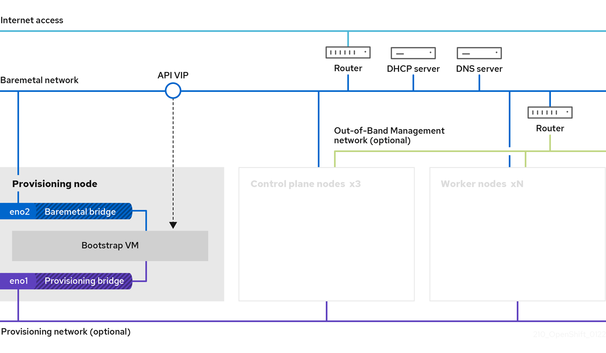
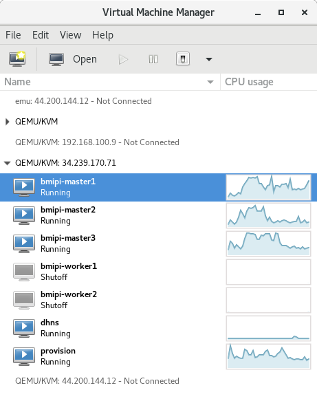

# Baremetal IPI Openshift 4 on libvirt KVM

## Table of contents

* [Introduction](#introduction)
* [Reference documentation](#reference-documentation)
* [Preparing the Hypervisor](#preparing-the-hypervisor)
* [Provisioning Network Based Architecture](#provisioning-network-based-architecture)
  * [Create the routable baremetal and provisioning networks in KVM](#create-the-routable-baremetal-and-provisioning-networks-in-kvm)
  * [Create the provisioning VM](#create-the-provisioning-vm) 
  * [Create the 3 empty master nodes](#create-the-3-empty-master-nodes)
  * [Create two empty worker nodes](#create-two-empty-worker-nodes)
  * [Install and set up vBMC in the physical node](#install-and-set-up-vbmc-in-the-physical-node) 
  * [Add firewall rules to allow the VMs to access the vbmcd service](#add-firewall-rules-to-allow-the-vms-to-access-the-vbmcd-service)
  * [Set up virtualization in the provisioning VM](#set-up-virtualization-in-the-provisioning-vm)
  * [Verify DNS resolution in the provisioning VM](#verify-dns-resolution-in-the-provisioning-vm) 
  * [Preparing the provisioning node for OpenShift Container Platform installation](#preparing-the-provisioning-node-for-openshift-container-platform-installation)
  * [Configure networking in the provisioning VM](#configure-networking-in-the-provisioning-vm)
  * [Get the pull secret Openshift installer and oc client](#get-the-pull-secret-openshift-installer-and-oc-client)
  * [Create the install config yaml file](#create-the-install-config-yaml-file)
  * [Install the Openshift cluster with BMC](#install-the-openshift-cluster-with-bmc) 
* [Creating the metal instance and KVM infrastructure with terraform and ansible](#creating-the-metal-instance-and-kvm-infrastructure-with-terraform-and-ansible)
* [Troubleshooting the installation](#troubleshooting-the-installation)
  * [Connecting to the VMs with virt-manager](#connecting-to-the-vms-with-virt-manager) 
* [Creating the support VM](#creating-the-support-vm)  
  * [Set up the DNS server](#set-up-the-DNS-server)
  * [Set up the DHCP server](#set-up-the-dhcp-server)
* [Setup the physical host in AWS](#setup-the-physical-host-in-aws)
  * [Import the VM providing DHCP and DNS services](#import-the-vm-providing-dhcp-and-dns-services)
* [Redfish based architecture](#redfish-based-architecture)
  * [Prepare the physical host](#prepare-the-physical-host)
  * [Install sushy-tools](#install-sushy-tools)
  * [Setup sushy-tools](#setup-sushy-tools) 
  * [Start and test sushy tools](#start-and-test-sushy-tools) 
  * [Add firewall rules to allow access to sushy-tools](#add-firewall-rules-to-allow-access-to-sushy-tools) 
  * [Setup DNS service](#setup-dns-service) 
  * [Create the provisioning VM](#create-the-provisioning-vm)
  * [Create the empty cluster hosts](#create-the-empty-cluster-hosts) 
  * [Prepare the provision VM](#prepare-the-provision-vm) 
  * [Create the install configuration yaml file](#create-the-install-configuration-yaml-file)
  * [Install the Openshift-cluster with redfish](#install-the-openshift-cluster-with-redfish) 
* [External access to Openshift using NGINX](#external-access-to-openshift-using-nginx)
  * [Install and set up NGINX](#install-and-set-up-nginx)
* [Enable Internal Image Registry](#enable-internal-image-registry)
  * [Add Storage to the Worker Nodes](#add-storage-to-the-worker-nodes)
  * [Make the internal image registry operational](#make-the-internal-image-registry-operational)

## Introduction

This repository contains documentation and supporting files on how to deploy an Openshift 4 cluster using the IPI method in a **baremetal** cluster on libvirt/KVM virtual machines.

The instruction given here are meant to deploy a test cluster and help understand the process of deploying a baremetal IPI Openshift 4 cluster at a reduced cost, compared to deploying the same cluster using real baremetal servers.

Even in the scenario depicted here, a powerfull physical server is required, given that it needs to host at least 6 VMs, each with its own requirements of memory, disk and CPU.  In case such server is not available, instructions are also provided to use a metal instance in AWS.

The documentation contains instructions on how to deploy the cluster with and without a provisioning network in the sections [Provisioning Network Based Architecture](#provisioning-network-based-architecture) and [Redfish based architecture](#redfish-based-architecture) respectively.

A section on how to create the infrastructure, including the metal instance in AWS and the libvirt VMs, using terraform and ansible is provided in section [Creating the metal instance and KVM infrastructure with terraform and ansible](#creating-the-metal-instance-and-kvm-infrastructure-with-terraform-and-ansible)

## Reference documentation

The official documentation explains in detail how to install an Openshift 4 cluster using the baremetal IPI method:
[Deploying installer-provisioned clusters on bare metal Overview](https://docs.openshift.com/container-platform/4.9/installing/installing_bare_metal_ipi/ipi-install-overview.html)

## Preparing the Hypervisor

The main two requirements for the physical host are:

* Contains enough compute resources (memory, CPU, disk) to support 6 or 7 virtual machines.  At least 64GB memory, 16 CPU cores and 500GB disk space is required.
* Supports libvirt/KVM virtualization 

The hypervisor's Operating System used in these instructions is RHEL 8, other linux distributions could be used but there will be some differences in the name of the packages installed, configuration files and options.

Refer to the section [Setup the physical host in AWS](#setup-the-physical-host-in-aws) to create a hypervisor host based on a metal instance in AWS.  

If a local server is going to be used, install and update the Operating System, register it with Red Hat (if using RHEL), and install the libvirt packages, check the section [Setup the physical host in AWS](#setup-the-physical-host-in-aws) for more details.


## Provisioning Network Based Architecture

The architecture design for this cluster is as follows:
* Uses libvirt/KVM based virtual machines.
* Uses both a bare metal network and a provisioning network.


  
The physical server (AKA hypervisor) must support nested virtualization and have it enabled: [Using nested virtualization in KVM](https://docs.fedoraproject.org/en-US/quick-docs/using-nested-virtualization-in-kvm/)

Check if nested virtualization is supported, a value of 1 means that it is supported and enabled.
```
# cat /sys/module/kvm_intel/parameters/nested
1
```

Enable nested virtualization if it is not, [Enabling nested virtualization in KVM](https://docs.fedoraproject.org/en-US/quick-docs/using-nested-virtualization-in-kvm/#_enabling_nested_virtualization): 

* Shut down all running KVM VMs
```
# virsh list
# virsh shutdown <vm name>
```
* Unload the kvm_probe kernel module
```
# modprobe -r kvm_intel
```
* Reload the kernel module activating the nesting feature 
```
# modprobe kvm_intel nested=1
```
* To enable it permanently, add the following line to the /etc/modprobe.d/kvm.conf file:
```
options kvm_intel nested=1
```

Later the provisioning VM must also be configured to support nested virtualization.

### Create the routable baremetal and provisioning networks in KVM

The definition for the __routable__ network can be found in the file _net-chucky.xml_ in this repository.  It is a simple definition of a routable network with no DHCP, using the network address space 192.168.30.0/24

The definition for the __provisioning__ network can be found in the file net-provision.xml in this repository.  The file contains the definition of a non routable network with no DHCP, using the network address space 192.168.14.0/24

Create the networks with the commands:
```
# virsh net-define net-chucky.xml
# virsh net-define net-provision.xml
```
Start the networks and enable autostart so they will be started automatically next time

```
# virsh net-start chucky
# virsh net-autostart chucky

# virsh net-start provision
# virsh net-autostart provision

# virsh net-list 
 Name            State        Autostart   Persistent
-------------------------------------------------------------
 chucky          active     yes                   yes
 default         active     yes                   yes
 provision      active     yes                   yes
```

Check the network configuration in the host, new bridges should appear
```
# ip -4 a
# nmcli con show
```

### Create the provisioning VM

Get the qcow2 image for RHEL 8 from [https://access.redhat.com/downloads/](https://access.redhat.com/downloads/), click on __Red Hat Enterprise Linux 8__ and download __Red Hat Enterprise Linux 8.5 KVM Guest Image__

Copy the qcow2 image file to the libvirt images directory 
```
# cp rhel-8.5-x86_64-kvm.qcow2 /var/lib/libvirt/images/provision.qcow2
# chown qemu: /var/lib/libvirt/images/provision.qcow2
```

Restore the SELinux file tags:
```
# restorecon -R -Fv /var/lib/libvirt/images/provision.qcow2
```

Create the VM instance based on the above image with the following commands.  The MAC address is specified in the command line to make it predictable and easier to match to other configuration files:
```
# virt-customize -a /var/lib/libvirt/images/provision.qcow2 --root-password password:mypassword --uninstall cloud-init

# virt-install --name=provision --vcpus=4 --ram=24096 \
            --disk path=/var/lib/libvirt/images/provision.qcow2,bus=virtio,size=120 \
            --os-variant rhel8.5 --network network=provision \
           --cpu host-passthrough,cache.mode=passthrough \
            --network network=chucky,model=virtio,mac=52:54:00:9d:41:3c \
            --boot hd,menu=on --graphics vnc,listen=0.0.0.0 --noreboot \
            --noautoconsole --console pty,target_type=virtio
```

Resize the VM disk to match the size specified in the previous command.  Do this before starting the VM:
```
# qemu-img resize /var/lib/libvirt/images/provision.qcow2 120G
```

Complete the resizing from inside the VM
```
# virsh start provision
```

Connect to the provision VM.  There are two alternatives:
* Through the virtual console (to leave the console use CTRL+] )
```
# virsh console provision
```
* Through an ssh connection, only if the VM already has a valid network configuration, this may require the support VM with DNS and DHCP services running.
```
# virsh domifaddr provision --source arp
 Name           MAC address              Protocol         Address
-------------------------------------------------------------------------------
 vnet2          52:54:00:9d:41:3c        ipv4             192.168.30.10/0

$ ssh root@192.168.30.10

[root@localhost ~]# growpart /dev/vda 3
...
[root@localhost ~]# xfs_growfs /dev/vda3
...
[root@localhost ~]# df -Ph
...
[root@provision ~]# exit
```

### Create the 3 empty master nodes

These VMs don’t include an OS, it will be installed during OCP cluster deployment.

Create the empty disks
```
# for x in master{1..3}; do echo $x; \
   qemu-img create -f qcow2 /var/lib/libvirt/images/bmipi-${x}.qcow2 80G; \
   done
```

Update the SELinux file labels
```
# restorecon -R -Fv /var/lib/libvirt/images/bmipi-master*
```

Change the owner and group to qemu:
```
# for x in master{1..3}; do echo $x; chown qemu: \
    /var/lib/libvirt/images/bmipi-${x}.qcow2; done
```

Create the 3 master VMs using the empty disks created in the previous step.  These are connected to both the routable and the provisioning networks.  The order in which the NICS are created is important so that if the VM cannot boot from the disk, which is the case at first boot, it will try to do it through the NIC in the provisioning network where the DHCP and PXE services from ironiq will provide the necessary information. 

The MAC addresses for the routable and provisioning network NICs are specified so they match the ones defined in the external DHCP server and the install-config.yaml file, without the need to update the configuration of those services every time a new set of machines are created:

```
# for x in {1..3}; do echo $x; virt-install --name bmipi-master${x} --vcpus=4 \
   --ram=16384 --disk path=/var/lib/libvirt/images/bmipi-master${x}.qcow2,bus=virtio,size=80 \
   --os-variant rhel8.5 --network network=provision,mac=52:54:00:74:dc:a${x} \
   --network network=chucky,model=virtio,mac=52:54:00:a9:6d:7${x} \
   --boot hd,menu=on --graphics vnc,listen=0.0.0.0 --noreboot \
   --noautoconsole; done
```

### Create two empty worker nodes

These don’t include an OS, it will be installed during OCP cluster deployment.

First create the empty disks:
```
# for x in worker{1..2}; do echo $x; \
   qemu-img create -f qcow2 /var/lib/libvirt/images/bmipi-${x}.qcow2 80G; done
```

Update the SELinux file labels
```
# restorecon -R -Fv /var/lib/libvirt/images/bmipi-worker*
```
Change the owner and group to qemu:
```
# for x in worker{1..2}; do echo $x; chown qemu: \
   /var/lib/libvirt/images/bmipi-${x}.qcow2; done
```

Create the 2 worker nodes using the empty disks created in the previous step.  These are connected to both the routable and the provisioning networks.  The order in which the NICS are created is important so that if the VM cannot boot from the disk, which is the case at first boot, it will try to do it through the NIC in the provisioning network first, where the DHCP and PXE services from ironiq will provide the necessary information. 

The MAC addresses for the routable and provisioning network NICs are specified so they can easily match the ones added to the external DHCP and install-config.yaml file, without the need to update the configuration of those services every time a new set of machines are created:
```
# for x in {1..2}; do echo $x; virt-install --name bmipi-worker${x} --vcpus=4 \
   --ram=16384 --disk \
   path=/var/lib/libvirt/images/bmipi-worker${x}.qcow2,bus=virtio,size=80 \
   --os-variant rhel8.5 --network network=provision,mac=52:54:00:74:dc:d${x} \
   --network network=chucky,model=virtio,mac=52:54:00:a9:6d:9${x} \
   --boot hd,menu=on --graphics vnc,listen=0.0.0.0 --noreboot \
   --noautoconsole; done
```

Check that all VMs are created:
```
# virsh list –all
```

### Install and set up vBMC in the physical node

The next steps must be taken in the physical host.

Install the following packages

```
# dnf install gcc libvirt-devel python3-virtualenv ipmitool
```
Create a python virtual environment to install vBMC
```
# virtualenv-3 virtualbmc

# . virtualbmc/bin/activate
```

Install virtual BMC in the python virtual environment:
```
(virtualbmc) # pip install virtualbmc
```

Start the vbmcd daemon in the python virtual environment.  In the Openshift cluster is rebooted after installation, this service must be started before starting the cluster nodes:
```
(virtualbmc) # ./virtualbmc/bin/vbmcd
```

Find the IP address of the bridge connected to the routable network (chucky) in the physical machine:
```
# virsh net-dumpxml chucky
…
  <bridge name='virbr2' stp='on' delay='0'/>
  <mac address='52:54:00:6a:56:bc'/>
  <ip address='192.168.30.1' netmask='255.255.255.0'>
  </ip>
</network>
```
Can also be checked with:
```
# ip -4 a show dev chucky
5: chucky: <BROADCAST,MULTICAST,UP,LOWER_UP> mtu 1500 qdisc noqueue state UP group default qlen 1000
    inet 192.168.30.1/24 brd 192.168.30.255 scope global chucky
```

Add the master and worker node VMs to virtual BMC, use the IP obtained before to contact the vbmcd daemon and a unique port for each VM, the ports are arbitrary but should be above 1024.  The name of the node is the one shown in the output of `virsh list –all` command.  A username and password is associated to each node that must be used later to control the VMs; in this case all nodes use the same username/password combination.  Keep in mind that the ipmi protocol used by BMC is not encrypted or secured in any way:
```
(virtualbmc) # for x in {1..3}; do vbmc add --username admin --password secreto \
                          --port 700${x} --address 192.168.30.1 bmipi-master${x}; done

(virtualbmc) # for x in {1..2}; do vbmc add --username admin --password secreto \
                          --port 701${x} --address 192.168.30.1 bmipi-worker${x}; done
```

Check that the VMs are accepted:
```
(virtualbmc) # vbmc list
+---------------+--------+--------------+------+
| Domain name   | Status | Address      | Port |
+---------------+--------+--------------+------+
| bmipi-master1 | down   | 192.168.30.1 | 7001 |
| bmipi-master2 | down   | 192.168.30.1 | 7002 |
| bmipi-master3 | down   | 192.168.30.1 | 7003 |
| bmipi-worker1 | down   | 192.168.30.1 | 7011 |
| bmipi-worker2 | down   | 192.168.30.1 | 7012 |
+---------------+--------+--------------+------+
```

Start a virtual BMC service for every virtual machine instance:
```
(virtualbmc) # for x in {1..3}; do vbmc start bmipi-master${x}; done

(virtualbmc) # for x in {1..2}; do vbmc start bmipi-worker${x}; done
```

The status in the vbmc list command changes to running.  This is not the VM running but the BMC service for that VM
```
(virtualbmc) # vbmc list
+---------------+---------+--------------+------+
| Domain name   | Status  | Address      | Port |
+---------------+---------+--------------+------+
| bmipi-master1 | running | 192.168.30.1 | 7001 |
| bmipi-master2 | running | 192.168.30.1 | 7002 |
| bmipi-master3 | running | 192.168.30.1 | 7003 |
| bmipi-worker1 | running | 192.168.30.1 | 7011 |
| bmipi-worker2 | running | 192.168.30.1 | 7012 |
+---------------+---------+--------------+------+
```

Verify Power status of VM's.  These commands use the user/password and IP/port defined before for each node:
```
(virtualbmc) # for x in {1..3}; do ipmitool -I lanplus -U admin -P secreto \
                    -H 192.168.30.1 -p 700${x} power status; done
Chassis Power is off
Chassis Power is off
Chassis Power is off

(virtualbmc) # for x in {1..2}; do ipmitool -I lanplus -U admin -P secreto \
                          -H 192.168.30.1 -p 701${x} power status; done
Chassis Power is off
Chassis Power is off
```
The KVM VMs can now be controlled through the vBMC server using the ipmi protocol.

### Add firewall rules to allow the VMs to access the vbmcd service. 

In order for the bootstrap server to be able to start the KVM VMs a rule must be added to the physical host firewall allowing connections from machines in the virtual networks chucky and provision to reach the ports defined earlier for each VM in vBMC

These rules are created in the physical host:
```
# firewall-cmd --add-port 7001/udp --add-port 7002/udp --add-port 7003/udp \
   --add-port 7011/udp --add-port 7012/udp --zone=libvirt --permanent
# firewall-cmd --reload
# firewall-cmd --list-all --zone libvirt
```
### Set up virtualization in the provisioning VM 

Further details at [Set up nested virtualization in the provisioning VM](https://docs.fedoraproject.org/en-US/quick-docs/using-nested-virtualization-in-kvm/#proc_configuring-nested-virtualization-in-virt-manager)

The support VM with DHCP and DNS services must be setup and running at this point.  For details on how to create this VM check the section [Creating the support VM](#creating-the-support-vm)  

If it is not running, start the provision VM
```
# virsh start provision 
```

Connect from the physical host to the provision VM using the IP defined in the DHCP server for that host
```
$ ssh root@192.168.30.10
```

Register the provision VM with Red Hat
```
# subscription-manager register --user <rh user>
# subscription-manager list --available
# subscription-manager attach --pool=8a589f...
```

Install the host virtualization software:
```
# dnf group install virtualization-host-environment
```

Update the Operating System
```
# dnf update
# reboot
```
Verify that the provisioning VM has virtualization correctly set up.  The last 2 warnings are not relevant, they also appear when running the same command in the physical host:
```
provision # virt-host-validate
  QEU: Checking for hardware virtualization                                     : PASS
  QEU: Checking if device /dev/kvm exists                                       : PASS
  QEU: Checking if device /dev/kvm is accessible                                : PASS
  QEU: Checking if device /dev/vhost-net exists                                 : PASS
  QEU: Checking if device /dev/net/tun exists                                   : PASS
  QEU: Checking for cgroup 'cpu' controller support                             : PASS
  QEU: Checking for cgroup 'cpuacct' controller support                         : PASS
  QEU: Checking for cgroup 'cpuset' controller support                          : PASS
  QEU: Checking for cgroup 'memory' controller support                          : PASS
  QEU: Checking for cgroup 'devices' controller support                         : PASS
  QEU: Checking for cgroup 'blkio' controller support                           : PASS
  QEU: Checking for device assignment IOU support                               : WARN (No ACPI DAR table found, IOU either disabled in BIOS or not supported by this hardware platform)
  QEU: Checking for secure guest support                                        : WARN (Unknown if this platform has Secure Guest support)
```

### Verify DNS resolution in the provisioning VM

Test that the DNS names of all nodes can be resolved from the provisioning VM
```
[root@provision ~]# for x in {1..3}; do dig master${x}.ocp4.tale.net +short; done
192.168.30.20
192.168.30.21
192.168.30.22
[root@provision ~]# for x in {1..2}; do dig worker${x}.ocp4.tale.net +short; done
192.168.30.30
192.168.30.31
```

### Preparing the provisioning node for OpenShift Container Platform installation

Further details can be obtained from the [official documentation](https://docs.openshift.com/container-platform/4.9/installing/installing_bare_metal_ipi/ipi-install-installation-workflow.html#preparing-the-provisioner-node-for-openshift-install_ipi-install-installation-workflow)

Log in to the provisioning VM
```
# virsh domifaddr provision --source arp
 Name       MAC address          Protocol     Address
-------------------------------------------------------------------------------
 vnet1      52:54:00:9d:41:3c    ipv4         192.168.30.10/0

# ssh root@192.168.30.10
```
Create a non privileged user and provide that user with sudo privileges::
```
# useradd kni
# passwd kni
# echo "kni ALL=(root) NOPASSWD:ALL" | tee -a /etc/sudoers.d/kni
# chmod 0440 /etc/sudoers.d/kni
```

Make sure the firewalld service is enabled and running:
```
# systemctl enable firewalld --now
# systemctl status firewalld
```
Enable the http service in the firewall.  Add the rules:
```
$ sudo firewall-cmd --zone=public --add-service=http --permanent
$ sudo firewall-cmd --reload
```

Create an ssh key for the new user:
```
# su - kni -c "ssh-keygen -t ed25519 -f /home/kni/.ssh/id_rsa -N ''"
```

Log in as the new user on the provisioner node:
```
# su - kni
```

Install the following required packages, some may already be installed:
```
$ sudo dnf install libvirt qemu-kvm mkisofs python3-devel jq ipmitool
```

Modify the user to add the libvirt group to the newly created user:
```
$ sudo usermod --append --groups libvirt kni
$ virsh -c qemu:///system list
```

Start and enable the libvirtd service, if it has not been done before:
```
$ sudo systemctl enable libvirtd --now
$ sudo systemctl status libvirtd
```

Create the default storage pool and start it:
```
$ virsh -c qemu:///system pool-define-as --name default --type dir --target /var/lib/libvirt/images 

$ virsh -c qemu:///system pool-list --all
 Name          State          Autostart
-----------------------------------------
 default           inactive   no

$ virsh -c qemu:///system pool-start default
Pool default started

$ virsh -c qemu:///system pool-autostart default
Pool default marked as autostarted

$ virsh -c qemu:///system pool-list --all --details
 Name          State        Autostart
--------------------------------------------
 default          active   yes
```

### Configure networking in the provisioning VM

The following network configuration allows the bootstrap VM created as a nested virtual machine inside the provisioning host to be reachable from outside the provisioning host.  The bootstrap VM is connected to the provisioning bridges (chucky and provision) directly which allows it to get IPs in the external networks and therefore be accessible from outside the provisioning VM
Do this from a local terminal or the connection will be dropped half way through the configuration process.

Apply these instructions Even if a network connection is already active and working.
```
# virsh console provision
# nmcli con show
NAME                                 UUID                                                                 TYPE              DEVICE
Wired connection 2  1af5c70e-3d13-3ca7-92a9-e2582e653372  ethernet  eth1   
virbr0                  b1ff2de8-0b3f-4d60-bb91-8b03078fc155               bridge            virbr0
Wired connection 1  3defbd59-64c2-3806-947a-c1be05a4752e  ethernet  --


# ip -4 a
…
3: eth1: <BROADCAST,ULTICAST,UP,LOWER_UP> mtu 1500 qdisc fq_codel state UP group default qlen 1000
        inet 192.168.30.10/24 brd 192.168.30.255 scope …
4: virbr0: <NO-CARRIER,BROADCAST,ULTICAST,UP> mtu 1500 qdisc noqueue state DOWN group default qlen 1000
        inet 192.168.122.1/24 brd 192.168.122.255 scope global virbr0
```

Set up the connection to the routable network
```
# nmcli con down "Wired connection 2"
Connection 'Wired connection 2' successfully deactivated …

# nmcli con delete "Wired connection 2"


# nmcli con add ifname baremetal type bridge con-name baremetal
# nmcli con add type bridge-slave ifname eth1 master baremetal
Connection 'bridge-slave-eth1' … successfully added.
```

Now the dhcp client should assign the same IP to the new bridge interface, this may take a couple minutes, if not, reactivate the connection:
```
# nmcli con down baremetal
# nmcli con up baremetal
```

Next the provisioning network interface is reconfigured, this can be done from an ssh connection to the provisioning host since the provisioning network interface does not affect that.
```
# nmcli con down "Wired connection 1"
Connection 'Wired connection 1' successfully deactivated …
# nmcli con delete "Wired connection 1"
Connection 'Wired connection 1' … successfully deleted.

# nmcli con add type bridge ifname provision con-name provision
Connection 'provision' … successfully added.
# nmcli con add type bridge-slave ifname eth0 master provision
Connection 'bridge-slave-eth0' … successfully added.
```

Assign an IPv4 address to the provision bridge.  Make sure the IP used is in the provisioning network but outside the DHCP range defined in the install-config.yaml file:
```
# nmcli con mod provision ipv4.addresses 192.168.14.14/24 \
    ipv4.method manual
```

Activate the provision network connection:
```
# nmcli con down provision
# nmcli con up provision
```

Check out the results
```
$ nmcli con show provision
$ ip -4 a
```

### Get the pull secret Openshift installer and oc client

In the provisioning VM, as the kni user, get a pull secret from [Red Hat](https://console.redhat.com/openshift/install/metal/user-provisioned), and paste it into a file in the kni user home directory.
```
$ vim pull-secret.txt
```

Download the Openshift client and installer.  The version to be installed can be any of the version numbers defined as directory names at [https://mirror.openshift.com/pub/openshift-v4/clients/ocp/](https://mirror.openshift.com/pub/openshift-v4/clients/ocp/).  To use the latest stable version for a particular minor version use the directory name `stable-<minor version`, in the following example the latest 4.9 version is used.
```
$ export VERSION=stable-4.9
$ export RELEASE_IMAGE=$(curl -s https://mirror.openshift.com/pub/openshift-v4/clients/ocp/$VERSION/release.txt | grep 'Pull From: quay.io' | awk -F ' ' '{print $3}')
$ export cmd=openshift-baremetal-install
$ export pullsecret_file=~/pull-secret.txt
$ export extract_dir=$(pwd)
$ echo $extract_dir
$ curl -s https://mirror.openshift.com/pub/openshift-v4/clients/ocp/$VERSION/openshift-client-linux.tar.gz | tar zxvf - oc
$ sudo cp oc /usr/local/bin
$ oc adm release extract --registry-config "${pullsecret_file}" --command=$cmd --to "${extract_dir}" ${RELEASE_IMAGE}
```

### Create the install config yaml file

The provided install-config.yaml file in this repository at **provisioning/install-config.yaml** contains a mostly functional template for installing the Openshift 4 cluste.  In particular, the IP addresses and networks, ports and MAC addresses match those used in other parts of this documentation.  The cluster name and DNS domain also match the ones used in the section [Creating the support VM ](#creating-the-support-vm)

Review the install-config.yaml file provided and add the pull secret downloaded in the previous section and an ssh public key, the one created for the kni user earlier for example, at the end of the file.

Check the [reference documentation](https://docs.openshift.com/container-platform/4.9/installing/installing_bare_metal_ipi/ipi-install-installation-workflow.html#configuring-the-install-config-file_ipi-install-installation-workflow) for details.

### Install the Openshift cluster with BMC

Create a directory and copy the install-config.yaml file into it.  This is done to make sure a copy of the install-cofig.yaml file survives the installation. The surviving copy is the one kept in the main directory:
```
$ mkdir ocp4
$ cp install-config.yaml ocp4/
```

Ensure all bare metal nodes are powered off, the following commands are run on the physical host:

Check the control plane hosts:
```
# for x in {1..3}; do ipmitool -I lanplus -U admin -P secreto \
                    -H 192.168.30.1 -p 700${x} power status; done
Chassis Power is off
Chassis Power is off
Chassis Power is off
```
Check the compute hosts:
```
# for x in {1..2}; do ipmitool -I lanplus -U admin -P secreto \
                          -H 192.168.30.1 -p 701${x} power status; done
Chassis Power is off
Chassis Power is off
```
If a previous failed installation happened, remove old bootstrap resources if any are left over from a previous deployment attempt.  The error about missing volume vda is normal, nothing to worry about.
```
$ ./openshift-baremetal-install destroy cluster --dir ocp4


$ sudo virsh list
 Id   Name                       State
--------------------------------------
 1        ocp4-876p7-bootstrap   running


$ sudo virsh destroy ocp4-876p7-bootstrap
Domain ocp4-876p7-bootstrap destroyed


$ sudo virsh undefine ocp4-876p7-bootstrap --remove-all-storage
error: Storage pool 'ocp4-876p7-bootstrap' for volume 'vda' not found.
Domain ocp4-876p7-bootstrap has been undefined
```
Finally run the installer from the provisioning host:
```
$ ./openshift-baremetal-install --dir ocp4/ create cluster
```

## Creating the metal instance and KVM infrastructure with terraform and ansible

The infrasctucture required to deploy the Openshift cluster can be created automatically with the terraform templates and ansible playbooks provided in this repository.  The process requires a few steps run in a serialized manner due to the matroshka design of the components.  The metal instance is created in the first place, then it is configure to support libvirt, then the libvirt resources are created, and finally some libvirts VMs are configured to support Openshift.

For these instructions to run successfully [terraform](https://www.terraform.io) and [ansible](https://www.ansible.com) must be installed and working in the local host.

* Go to the [Terraform directory](Terraform/README.md) and follow the instructions to deploy the metal instance and associated components in AWS.

* Go to the [Ansible directory](Ansible/README.md) and follow the instructions in the sections: [subscribe the host with Red Hat](Ansible/README.md#subscribe-hosts-with-red-hat), [Add the ssh key to ansible](Ansible#add-the-common-ssh-key) and [Running the playbook to configure the metal instance](Ansible#running-the-playbook-to-configure-the-metal-ec2-instance)

* Go to the [Terraform/libvirt directory](Terraform/libvirt/README.md) and follow the instructions to create the libvirt/KVM resources on top of which the Openshift cluster will be deployed.

* Go back to the [Ansible directory](Ansible/README.md) and follow the instructions in sections [Set up KVM instances](Ansible#set-up-kvm-instances) and [Running the playbook for libvirt VMs](Ansible#running-the-playbook-for-libvirt-vms)

* SSh into the provisioning node as the kni user. Make sure to [add the ssh key to the shell](Ansible#add-the-common-ssh-key). The connection can be stablish [using the EC2 instance as a jump host](Ansible#running-tasks-in-via-a-jumphost-with-ssh)
```
$ ssh -J ec2-user@3.219.143.250  kni@192.168.30.3
```
  * The home directory of the kni user contains all necessary files to run the Openshift installation, and all the require infrastructure should be in place and ready.

  * Review the install-config.yaml file and add or modify the configuratin options.

  * Copy the install-config.yaml file into the directory with the name of the cluster

  * Run the [Openshift installer](#install-the-openshift-cluster-with-bmc)

## Troubleshooting the installation

Check the installation log in the provisioning host as the kni user:
```
$ tail -f ocp4/.openshift_install.log
```
Check if the bootstrap VM has been created and is running in the provisioning node (nested virtualization):
```
[kni@provision ~]$ sudo virsh list --all
 Id        Name                            State
--------------------------------------------------------
 1        ocp4-x7578-bootstrap   running
```

If the bootstrap is running, ssh into it and check the logs there.

To get the bootstrap VM IP run the following commands in the provisioning VM:
```
$ sudo virsh list
$ sudo virsh domifaddr <bootstrap name> --source arp
```
Connect to the bootstrap node using the core user, the ssh certificate that was used in the install-config.yaml file and the IP obtained in the previous step.  The connection can be initiated from the physical host or the provisioning VM:
```
# ssh -i .ssh/bmipi core@192.168.30.80
```

Check the pods running in the bootstrap V
```
# sudo podman ps
```


Check the logs in the ironic pods
```
[core@localhost ~]$ sudo podman logs -f ironic-inspector
[core@localhost ~]$ sudo podman logs -f ironic-conductor
[core@localhost ~]$ sudo podman logs -f ironic-api
```

Run ipmitool from the ironic-conductor pod
```
$ sudo podman exec -ti ironic-conductor /bin/bash
[root@localhost /]# ipmitool -I lanplus -U admin -P secreto -H 192.168.30.1 \
-p 7000 power status           
Error: Unable to establish IPI v2 / RCP+ session
The same command from the provisioning host does not work either.
However that command does work from the physical host so it looks like this is a firewall issue.
```

To use tcpdump inside the bootstrap machine check the following [documentation section](https://docs.openshift.com/container-platform/4.9/support/gathering-cluster-data.html#about-toolbox_gathering-cluster-data) and [KCS](https://access.redhat.com/articles/4365651)


The provisioning network configuration can be checked with the following command:
```
$ oc get provisioning -o yaml
```


The baremetal hosts configuration can be retrieved with the following command:
```
$ oc -n openshift-machine-api get bmh
```

### Connecting to the VMs with virt-manager

These instructions can be applied when the physical host is an AWS metal instance, for other cases, adpat accordingly.

Add the ec2-user to the libvirt group:
```
$ sudo usermod -a -G libvirt ec2-user
$ virsh -c qemu:///system list
```

Add firewall rules in the physical host to connect to the VNC ports. Better to use a range of ports
```
$ sudo firewall-cmd --add-port 5900-5910/tcp --zone=public  --permanent
$ sudo firewall-cmd --reload
$ sudo firewall-cmd --list-all --zone public
```

Add the same ports above to the security rule in the AWS instance

Connect to libvirt daemon from the local host using virt-manager, with a command like:
```
$ virt-manager -c 'qemu+ssh://ec2-user@44.200.144.12/system?keyfile=benaka.pem'
```
This command may take a couple minutes before actually showing the virt-manager interface.



In the “Display VNC” section of the VM hardware details in virt-manager, the field Address must contain the value __All interfaces__.  This can be set at VM creation with virt-manager as the examples in this document show, using the option __--graphics vnc,listen=0.0.0.0__.

## Creating the support VM

This VM will run the DHCP and DNS services.  It is based on the rhel 8 qcow2 image

Copy the qcow2 image file to the libvirt images directory 

```
# cp rhel-8.5-x86_64-kvm.qcow2 /var/lib/libvirt/images/dhns.qcow2
```

Create the VM instance based on the above image with the following commands:
```
# virt-customize -a /var/lib/libvirt/images/dhns.qcow2 \
    --root-password password:mypassword --uninstall cloud-init

# virt-install --name=dhns --vcpus=2 --ram=1536 \
--disk path=/var/lib/libvirt/images/dhns.qcow2,bus=virtio,size=40 \
--os-variant rhel8.5 --network network=chucky,model=virtio --boot hd,menu=on \
--graphics vnc,listen=0.0.0.0 --noreboot --noautoconsole --console pty,target_type=virtio

# qemu-img resize /var/lib/libvirt/images/dhns.qcow2 40G
# qemu-img info /var/lib/libvirt/images/dhns.qcow2
# virsh start dhns
# virsh console dhns
[root@localhost ~]# growpart /dev/vda 3
# xfs_growfs /dev/vda3
```

Set up IP configuration.  Networking will be reconfigured during the setup of the VM, but for now it requires the ability to install packages.

```
# nmcli con delete "Wired connection 1"
# nmcli con add con-name eth0 type ethernet \
    ifname eth0 autoconnect yes ip4 192.168.30.3 gw4 192.168.30.1
# nmcli con mod eth0 +ipv4.dns 192.168.100.1
# nmcli con up eth0
```

Subscribe the VM to Red Hat

```
# subscription-manager register --user <rh user>
# yum update
# reboot
```

Assign a permanent hostname
```
# hostnamectl set-hostname dhns.tale.net
```
Install the packages for DNS and DHCP services
```
# yum install bind bind-utils dhcp-server
```

### Set up the DNS server

Start and enable named:
```
# systemctl enable --now named
```

Use the configuration files in the **support-files** directory in this repository as a base for the configuraion.  Keep in mind that if these files are modified, the configuration in other parts of the deployment process will be affected

```
/etc/named.conf
/etc/named/tale.zones
/var/named/tale.net.zone
/var/named/tale.net.rzone
```

Change the owner of the last two files:
```
# chown named:named /var/named/tale.net.zone /var/named/tale.net.rzone
```

Reload the bind named:
```
# systemctl reload named
```

Check for errors:
```
# journalctl -u named -e
```

Verify forward and reverse resolution:
```
# dig @192.168.30.3 master1.ocp4.tale.net +short
# dig @192.168.30.3 -x 192.168.30.3 +short
```

Update the network configuration to reflect the new DNS server
```
# nmcli con mod eth0 +ipv4.dns 127.0.0.1 -ipv4.dns 192.168.100.1 \
   +ipv4.dns-search tale.net
```

Restart the network connection, this must be done on a local connection because the network will go down after the first command:
```
# nmcli con down eth0
# nmcli con up eth0
```

### Set up the DHCP server

Use the configuration files in the support-files directory in this repository as a base for the configuraion.  Keep in mind that if these files are modified, the configuration in other parts of the deployment process will be affected

/etc/dhcp/dhcpd.conf

Enable and start the dhcpd service
```
# systemctl enable dhcpd –now
```

After any modification to the configuration file restart the dhcpd daemon and check the log messages it generates:
```
# systemctl restart dhcpd
# journalctl -u dhcpd -e
```

## Setup the physical host in AWS

This section describes how to set up a metal instance in AWS to be used as the physical server (AKA hypervisor) in which the KVM virtual machines will run.

The same process described here can be automated with terraform and ansible, check the [Terraform](https://github.com/tale-toul/OCP4baremetalIPI/blob/main/Terraform) and [Ansible](https://github.com/tale-toul/OCP4baremetalIPI/blob/main/Ansible) directories for futher instructions.

In the AWS web site go to __EC2__ -> __Instances__ -> __Launch Instances__

Select the AMI __Red Hat Enterprise Linux 8 (HVM), SSD Volume Type__, 64 bit (x86) architecture.

In the Instance type page select __c5n.metal__ (192GB RAM, 72 vCPUs) -> __Configure Instance Details__

Select the VPC and subnet where the host will be deployed.  The subnet must have Internet access properly configured and the instance must get a public IP.

Go to the __Add Storage__ section and set the size of the root device (/dev/sda1) to 40 GB.  Add a new EBS volume (/dev/sdb) of 1000 GB, select the option __Delete on Termination__ for both volumes.

Go to __Add Tags__ section -> __Add Tag__ -> Key=__Name__; Value=__baremetal-ipi__.  This is an optional step, but helps in identifying the instance when more instance exist.

Go to __Configure Security Group__.  Optionally for security reasons set the source for the SSH connections to __My IP__.  Add a new rule for the VNC service: __Add Rule__ -> Type=__Custom TCP__; Protocol=__TCP__; Port Range=__5900-5910__; Source=__My IP__; Description=__VNC__.  Add rules for __HTTP__ and __HTTPS__, these can be selected from the Type drop down.  Add a rule for the __API endpoint__, TCP port 6443.

Go to __Review and Launch__ -> __Launch__

Select an existing key pair or create a new one.  If a new one is created, download the key pair file and change its permissions:
```
$ chmod 0400 baremetalipi.pem
```
Tick the acknowledgement message " __Launch Instances__"

The metal instance will take a few minutes to start and get ready.  When the instance is up and running, connect via ssh using the key file and the instance public IP address.  This public IP will change when the host is rebooted.
```
$ ssh -i baremetalipi.pem ec2-user@35.178.191.131
```

Subscribe the host to Red Hat
```
$ sudo subscription-manager register –username <username>
```

Install the virtualization host group to support KVM virtual machines:
```
$ sudo dnf group install virtualization-host-environment
```

Install these additional packages:
```
$ sudo dnf install virt-install  libguestfs-tools tmux
```

Update the rest of the packages
```
$ sudo dnf update
```

Shutdown the instance.  In the AWS web site, go to __EC2__ -> __Instances__ -> Select the newly created instance -> __Instance State__ -> __Stop Instance__

When the instance shows a state of __Stopped__, go to __Instance State__ -> __Start instance__

When the instance is in state Running and has passed all Status checks.  Get its public IP and ssh into it
```
$ ssh -i baremetalipi.pem ec2-user@18.170.69.216
```

Optional. Start a tmux session:
```
$ tmux
```

Get the name of the device associated with the 1TB disk
```
$ sudo lsblk|grep 1000G
```
Partition the 1TB disk.  Create a single partition covering the whole disk:
```
$ sudo cfdisk /dev/nvme1n1 
```

Format the partition:
```
$ sudo mkfs.xfs /dev/nvme1n1p1
```

Mount the partition in /var/lib/libvirt/images

* Get the partition ID
```
$ sudo blkid
```
* Add an entry like the following to the /etc/fstab file
```
UUID=95534019-3…e04d98199 /var/lib/libvirt/images  xfs         defaults            0 0
```
* Restrict the permissions of the directory
```
$ sudo chmod 0751 /var/lib/libvirt/images/
```
* Apply the SeLinux file tags to the directory
```
$ sudo restorecon -R -Fv /var/lib/libvirt/images/ 
```
Create an storage pool for KVM VMs:
```
$  sudo virsh pool-define-as default dir --target /var/lib/libvirt/images/
$  sudo virsh pool-build default
$  sudo virsh pool-start default
$  sudo virsh pool-autostart default
$  sudo virsh pool-list --all --details
```
   
Start and enable the libvirtd service
```
$ sudo systemctl start libvirtd
$ sudo systemctl enable libvirtd
```

Create the virtual networks: routable and provisioning using the xml definitions at the top of the doc


### Import the VM providing DHCP and DNS services

* Copy the qcow2 and the xml definition files:
```
# scp -i benaka.pem /var/lib/libvirt/images/dhns.qcow2 dhns.xml ec2-user@44.198.53.71:
$  sudo mv dhns.qcow2 /var/lib/libvirt/images
$  sudo ls -l /var/lib/libvirt/images
$  sudo chown qemu: /var/lib/libvirt/images/dhns.qcow2
$  sudo virsh define dhns.xml
$ sudo virsh start dhns
```

Copy the rhel8 qcow2 image: 
```
# scp -i benaka.pem rhel-8.5-x86_64-kvm.qcow2 ec2-user@44.198.53.71:
```

## Redfish based architecture

In this architecture there is no provisioning network, only a routable network is required.  

The redfish protocol is provided by sushy tools.

The following links contain additional information about sushy-tools:

[https://docs.openstack.org/sushy-tools/latest/](https://docs.openstack.org/sushy-tools/latest/)
[https://gist.github.com/williamcaban/e5d02b3b7a93b497459c94446105872c](https://gist.github.com/williamcaban/e5d02b3b7a93b497459c94446105872c)

### Prepare the physical host

A physical host with libvirt/KVM virtual machines will be used in this demonstration.

Prepare the physical host as described in section [Setup the physical host in AWS](#setup-the-physical-host-in-aws)

The default virtual network in libvirt can be used, but in this case a specific network is created for the OCP cluster.  Follow the instructions in section [Create the routable baremetal and provisioning networks in KVM](#create-the-routable-baremetal-and-provisioning-networks-in-kvm), but only create the baremetal network.

### Install sushy-tools

In the physical host Install the following packages:
```
# dnf install libvirt-devel gcc python3-virtualenv httpd-tools
```

Create a python virtual environment 
```
# virtualenv-3 sushy-tools
# . sushy-tools/bin/activate
```

Install sushy tools
```
# pip3 install sushy-tools libvirt-python
```

### Setup sushy-tools

Create an SSL certificate to encrypt redfish communications (sushy tools).  Data entered to describe the certificate is not relevan in most cases:
```
$ openssl req -newkey rsa:2048 -x509 -sha256 -days 3650 \
-nodes -out sushy.cert -keyout sushy.key
Generating a RSA private key
..........................................+++++
.+++++
writing new private key to 'sushy.key'
-----
You are about to be asked to enter information that will be incorporated
into your certificate request.
What you are about to enter is what is called a Distinguished Name or a DN.
There are quite a few fields but you can leave some blank
For some fields there will be a default value,
If you enter '.', the field will be left blank.
-----
Country Name (2 letter code) [XX]:es
State or Province Name (full name) []:
Locality Name (eg, city) [Default City]:
Organization Name (eg, company) [Default Company Ltd]:
Organizational Unit Name (eg, section) []:
Common Name (eg, your name or your server's hostname) []:sushy-tools
Email Address []:
```

Review certificate:
```
$ openssl x509 -in sushy.cert -text -noout|less
```

Create a user file with a single user for basic HTTP authentication, that will be used by susy-tools.  Queries to the sushy-tools service will need to authenticate with this user.
```
$ htpasswd -c -B -b htusers admin password
```

Create the configuration file for the sushy-tools service. A reference file is provided in this repository at __sushy.conf__.  Use the correct values for the SSL certificate path, the http basic users file, etc.

The file specified in the section SUSHY_EULATOR_BOOT_LOADER_AP must be present in the system.  In the case of RHEL8 this file belongs to the package edk2-ovmf.


### Start and test sushy tools

Start the service with a command like the following.  The path to the configuration file must be absolute, not relative:
```
(sushy-tools)$ sushy-tools/bin/sushy-emulator --config /home/ec2-user/OCP4baremetalIPI/sushy.conf
 * Serving Flask app 'sushy_tools.emulator.main' (lazy loading)
 * Environment: production
   WARNING: This is a development server. Do not use it in a production deployment.
   Use a production WSGI server instead.
 * Debug mode: off
 * Running on all addresses.
   WARNING: This is a development server. Do not use it in a production deployment.
 * Running on https://172.31.75.189:8080/ (Press CTRL+C to quit)
```

In another terminal test the service with curl, the URL is obtained from the output above:
```
$ curl -k --user admin:password  https://172.31.75.189:8080/redfish/v1/Systems/                                                                             
{
"@odata.type": "#ComputerSystemCollection.ComputerSystemCollection",
"Name": "Computer System Collection",
"embers@odata.count": 1,
"embers": [
                {
                    "@odata.id": "/redfish/v1/Systems/44e3c29b-325e-4ad3-9859-c29233204a8a"
                }
],
        "@odata.context": "/redfish/v1/$metadata#ComputerSystemCollection.ComputerSystemCollection",                                                                                         
        "@odata.id": "/redfish/v1/Systems",
        "@Redfish.Copyright": "Copyright 2014-2016 Distributed anagement Task Force, Inc. (DTF). For the full DTF copyright policy, see http://www.dmtf.org/about/policies/copyright."
```

### Add firewall rules to allow access to sushy-tools

In order for the bootstrap VM to be able to control the cluster VMs via redfish protocol a firewall rule allowing access to the port where the susy-tools server is listening needs to be added to the physical host: 
```
$ sudo firewall-cmd --add-port 8080/tcp --zone=libvirt --permanent
$ sudo firewall-cmd --reload
$ sudo firewall-cmd --list-all --zone libvirt
```

### Setup DNS service

A DNS server is required to resolve the names of the hosts in the cluster and some additional service names.  Follow the instructions in the section [Creating the support VM](#creating-the-support-vm).

Alternatively the support VM can be imported following the instructions in section [Import the VM providing DHCP and DNS services](#import-the-vm-providing-dhcp-and-dns-services).

The DHCP service is optional but recommended, it is used to provide network configuration for the provisioning VM and the nodes in the OCP cluster.

### Create the provisioning VM

Create the provisioning VM following the instructions in section [Create the provisioning VM](#create-the-provisioning-vm), replace the virt-install command with the following one, which is slightly different; apply the other creation steps unchanged: 

* The reference to the provision network is removed since no such network exists
* Make sure the MAC address is unique and is the one used by the DHCP server for this VM.
```
$ sudo virt-install --name=provision --vcpus=4 --ram=24096 \
  --disk path=/var/lib/libvirt/images/provision.qcow2,bus=virtio,size=120  \
  --os-variant rhel8.5 --cpu host-passthrough,cache.mode=passthrough  \
  --network network=chucky,model=virtio,mac=52:54:00:9d:41:3c \
  --boot hd,menu=on --graphics vnc,listen=0.0.0.0 --noreboot \
  --noautoconsole --console pty,target_type=virtio
```

### Create the empty cluster hosts

Additional details can be found in the sushy-tools documentation [site](https://docs.openstack.org/sushy-tools/latest/user/dynamic-emulator.html)

Follow the instructions in sections [Create the 3 empty master nodes](#create-the-3-empty-master-nodes) and [Create two empty worker nodes](#create-two-empty-worker-nodes).
The virt-install commands are slightly different from the ones in the sections above because they don't link the hosts to the provision network, which is not used in this case:
```
# for x in {1..3}; do echo $x; virt-install --name bmipi-master${x} --vcpus=4  \ 
--ram=16384 --disk path=/var/lib/libvirt/images/bmipi-master${x}.qcow2,bus=virtio,size=40 \
--os-variant rhel8.5 --network network=chucky,model=virtio,mac=52:54:00:a9:6d:7${x} \
--boot hd,menu=on --graphics vnc,listen=0.0.0.0 --noreboot  --noautoconsole; done


# for x in {1..2}; do echo $x; virt-install --name bmipi-worker${x} --vcpus=4 \
 --ram=16384 --disk path=/var/lib/libvirt/images/bmipi-worker${x}.qcow2,bus=virtio,size=40  \
 --os-variant rhel8.5 --network network=chucky,model=virtio,mac=52:54:00:a9:6d:9${x} \        
 --boot hd,menu=on --graphics vnc,listen=0.0.0.0 --noreboot --noautoconsole; done
```

Check that the VMs are detected by susy-tools.  Use the URL reported when sushy-tools is started:
```
$ curl -k --user admin:password https://172.31.75.189:8080/redfish/v1/Systems/
{
        "@odata.type": "#ComputerSystemCollection.ComputerSystemCollection",
        "Name": "Computer System Collection",
        "embers@odata.count": 7,
        "embers": [
            
                {
                    "@odata.id": "/redfish/v1/Systems/a95336a0-7213-4df4-a0cd-1796aba76ecb"
                },
            
                {
                    "@odata.id": "/redfish/v1/Systems/36a19373-be1c-448c-8b4e-91ef597cb8e3"
                },
            
                {
                    "@odata.id": "/redfish/v1/Systems/335fe8b6-7ae4-4bf8-a492-8e11873be01b"
                },
            
                {
                    "@odata.id": "/redfish/v1/Systems/44e3c29b-325e-4ad3-9859-c29233204a8a"
                },
            
                {
                    "@odata.id": "/redfish/v1/Systems/11adbf9b-6f09-4502-bd5d-3d4d4e4a4895"
                },
            
                {
                    "@odata.id": "/redfish/v1/Systems/245184e0-9e76-42a7-b8c1-f8f64164bc82"
                },
            
                {
                    "@odata.id": "/redfish/v1/Systems/639e3f63-72d8-4a48-9052-3c1175a7a4ea"
                }
…
```

The character string for every __@odata.id__ entry is the UUID of the libvirt VM, and should match the output from the following command:
```
$ sudo virsh list --all --name --uuid
44e3c29b-325e-4ad3-9859-c29233204a8a dhns                              
335fe8b6-7ae4-4bf8-a492-8e11873be01b provision                         
245184e0-9e76-42a7-b8c1-f8f64164bc82 bmipi-master1                     
a95336a0-7213-4df4-a0cd-1796aba76ecb bmipi-master2                     
36a19373-be1c-448c-8b4e-91ef597cb8e3 bmipi-master3                     
11adbf9b-6f09-4502-bd5d-3d4d4e4a4895 bmipi-worker1                     
639e3f63-72d8-4a48-9052-3c1175a7a4ea bmipi-worker2
```

### Prepare the provision VM

Follow the instructions in sections:
* [Set up virtualization in the provisioning VM](#set-up-virtualization-in-the-provisioning-vm)
* [Preparing the provisioning node for OpenShift Container Platform installation](#preparing-the-provisioning-node-for-openshift-container-platform-installation)
* [Configure networking in the provisioning VM](#configure-networking-in-the-provisioning-vm). Apply only the parts referring to the baremetal network.
* [Get the pull secret, Openshift installer and oc client](#get-the-pull-secret-openshift-installer-and-oc-client)
 
### Create the install configuration yaml file

Use the install-config.yaml file provided in this repository at **redfish/install-config.yaml** as a reference, keep in mind that cluster name, DNS domain, IPs, ports, MACs, etc. match other configurations options defined in other parts of this document, and changing them in this file without updating those other configurations will break the deployment process.

The VM’s UUID and its MAC address is required for each VM, use the following command to get that information.  Run this command in the physical host:

```
$ for x in bmipi-master1 bmipi-master2 bmipi-master3 bmipi-worker1 bmipi-worker2; do echo -n "${x} "; sudo virsh domuuid $x|tr "\n" " "; \
  sudo virsh domiflist $x| awk '/52:54/ {print $NF}'; done
bmipi-master1: 245184e0-9e76-42a7-b8c1-f8f64164bc82  52:54:00:a9:6d:71
bmipi-master2: a95336a0-7213-4df4-a0cd-1796aba76ecb  52:54:00:a9:6d:72
bmipi-master3: 36a19373-be1c-448c-8b4e-91ef597cb8e3  52:54:00:a9:6d:73
bmipi-worker1: 11adbf9b-6f09-4502-bd5d-3d4d4e4a4895  52:54:00:a9:6d:91
bmipi-worker2: 639e3f63-72d8-4a48-9052-3c1175a7a4ea  52:54:00:a9:6d:92
```
Adding the section rootDeviceHints is required, unlike when doing the installation using a provisioning network.

Use the IP address reported by the susy-tools server when it was started, in the __address:__ URI 
```
...
 * Running on https://172.31.69.209:8080/ (Press CTRL+C to quit) 
```

Update the hosts section and use the appropriate values for UUID and MAC for each node, for example for bmipi-master1:
```
        bmc:
          address: redfish-virtualmedia://172.31.69.209:8080/redfish/v1/Systems/245184e0-9e76-42a7-b8c1-f8f64164bc82  
          disableCertificateVerification: True
          username: admin
          password: password
        bootMACAddress: 52:54:00:a9:6d:71
        rootDeviceHints:
            deviceName: /dev/vda
```


Add the pull secret and the ssh key at the end of the file.

### Install the Openshift cluster with redfish

Create a directory and copy the install-config.yaml file into it.  This is done to make sure a copy of the install-cofig.yaml file survives the installation. The surviving copy is the one kept in the main directory:
```
$ mkdir ocp4
$ cp install-config.yaml ocp4/
```

If a previous failed install happened, remove old bootstrap resources if any are left over from a previous deployment attempt
```
$ ./openshift-baremetal-install destroy cluster --dir ocp4


$ sudo virsh list
 Id   Name                       State
--------------------------------------
 1        ocp4-876p7-bootstrap   running


$ sudo virsh destroy ocp4-876p7-bootstrap
Domain ocp4-876p7-bootstrap destroyed


$ sudo virsh undefine ocp4-876p7-bootstrap --remove-all-storage
error: Storage pool 'ocp4-876p7-bootstrap' for volume 'vda' not found.
Domain ocp4-876p7-bootstrap has been undefined
```
The error about missing volume vda is normal, nothing to worry about.


Run the installation from the provisioning host:
```
$ ./openshift-baremetal-install --dir ocp4/ create cluster
```

## External access to Openshift using NGINX

The Openshift cluster resulting from applying the instructions in this document is only accessible from the physical and the provisioning hosts, this is because the IPs for the API endpoint and ingress controller are assigned from the virtual network created by libvirt, and this network is not accessible from outside the physical host.

One possible solution to access the cluster from outside the physical host is to deploy a reverse proxy in said the physical host and use it to rely requests to the Openshift cluster.

In this documentation a reverse proxy based on NGINX is used.

The reverse proxy contains different configuration sections for accessing the API endpoint, secure application routes through port 443 and insecure application routes through on port 80.

The external DNS names used to access the applications and API endpoint can be different from the internal ones used by Openshift.  If the Openshift cluster was deployed using an internal DNS zone that is not resolvable from outside the physical host (tale.net), the reverse proxy can do the translation between the external and internal zones.

The one caveat about DNS zones translation is that the web console (https://console-openshift-console.apps.tale.net) and the OAuth server (https://oauth-openshift.apps.ocp4.tale.net) can only be accessed using a single URL and DNS zone, so zone translation in the reverse proxy does not work for these URLs.  The console and oauth URLs can be changed from their default values, but can only be accessed using the defined URL: [Customizing the console route](https://docs.openshift.com/container-platform/4.9/web_console/customizing-the-web-console.html#customizing-the-console-route_customizing-web-console) [Customizing the OAuth server URL](https://docs.openshift.com/container-platform/4.9/authentication/configuring-internal-oauth.html#customizing-the-oauth-server-url_configuring-internal-oauth)  

A local DNS server based on dnsmasq could be used to resolve the console and oauth internal DNS names, but adding the names to the locahost file should also work.

Additional details about the NGINX configuration can be found in the [nginx directory](nginx/)

### Install and set up NGINX
The following commands must be run in the physical host.

Install NGINX packages
```
$ sudo dnf install nginx
```

Enable and start NGINX service
```
$ sudo systemctl enable nginx --now
$ sudo systemctl status nginx
```
Create DNS entries for the API endpoint and the default ingress controller.  The public DNS zone used in this example to access the Openshift cluster is _ocp4.redhat.com_

Create DNS entries for api.ocp4.redhat.com and \*.apps.ocp4.redhat.com resolving to the public IP of the physical host.  Do this in the public DNS resolver for the hosting the zone, for example route 53 in AWS, or using dnsmasq in your localhost.  

```
$ host api.ocp4.redhat.com
api.ocp4.redhat.com has address 34.219.150.17

$ host *.apps.ocp4.redhat.com 
*.apps.ocp4.redhat.com has address 34.219.150.17
```

Create a file in NGINX defining the reverse proxy configuration to access the Openshift cluster and place it in **/etc/nginx/conf.d/**.  An example file is provided in this repository at nginx/ocp4.conf:

Copy the file to /etc/nginx/conf.d/
```
$ sudo cp ocp4.conf /etc/nginx/conf.d/
```
The NGINX configuration file contains the definition for a virtual server to access secure application routes, this virtual server definition requires an SSL certificate to encrypt connections between the client and the NGINX server.  This certificate should be valid for the DNS domain served by the virtual server, in the example __apps.ocp4.redhat.com__, however the certificate used in this example is obtained from the Openshift cluster default ingress controller which is valid for __apps.ocp4.talnet.net__: 

Extracted the cerfiticate from the OCP 4 cluster, the following command will create two files:
```
$ oc extract secret/router-certs-default -n openshift-ingress
tls.crt
tls.key
```
Copy the certificate files to the path specified in the NGINX virtual server configuration:
```
  ssl_certificate "/etc/pki/nginx/ocp-apps.crt";
  ssl_certificate_key "/etc/pki/nginx/private/ocp-apps.key";
```
Create the directories if they don't exist, and copy the files
```
$ sudo mkdir /etc/pki/nginx/
$ sudo cp tls.crt /etc/pki/nginx/ocp-apps.crt
$ sudo mkdir /etc/pki/nginx/private/
$ sudo cp tls.key /etc/pki/nginx/private/ocp-apps.key
$ sudo ls -l /etc/pki/nginx/
```
A similar procedure is used to collect the API endpoint x509 certificate, the __--confirm__ option is used to overwrite any existing file with the same name.
```
$ oc extract secret/external-loadbalancer-serving-certkey -n openshift-kube-apiserver --confirm
```
Copy the certificate files to the path specified in the NGINX virtual server configuration:
```
  ssl_certificate "/etc/pki/nginx/ocp-api.crt";
  ssl_certificate_key "/etc/pki/nginx/private/ocp-api.key";

$ sudo cp tls.crt /etc/pki/nginx/ocp-api.crt
$ sudo cp tls.key /etc/pki/nginx/private/ocp-api.key
$ sudo ls -l /etc/pki/nginx/
```
Restore the SELinux file labels:
```
$ sudo restorecon -R -Fv /etc/pki/nginx
Relabeled /etc/pki/nginx from unconfined_u:object_r:cert_t:s0 to system_u:object_r:cert_t:s0
Relabeled /etc/pki/nginx/ocp-apps.crt from unconfined_u:object_r:cert_t:s0 to system_u:object_r:cert_t:s0
Relabeled /etc/pki/nginx/private from unconfined_u:object_r:cert_t:s0 to system_u:object_r:cert_t:s0
Relabeled /etc/pki/nginx/private/ocp-apps.key from unconfined_u:object_r:cert_t:s0 to system_u:object_r:cert_t:s0
Relabeled /etc/pki/nginx/private/ocp-api.key from unconfined_u:object_r:cert_t:s0 to system_u:object_r:cert_t:s0
Relabeled /etc/pki/nginx/ocp-api.crt from unconfined_u:object_r:cert_t:s0 to system_u:object_r:cert_t:s0
```

Review the configuration file and update the IP associated with the **proxy_pass** directives, use the IP for the internal default ingress controller and the API endpoint.  
```
provision $ dig +short \*.apps.ocp4.tale.net
192.168.30.110
provision $ dig + short \api.ocp4.tale.net
192.168.30.100

...
    proxy_pass https://192.168.30.110;
...
    proxy_pass https://192.168.30.100;
```

Use the correct external and internal DNS domains in every virtual server definition:
```
...
  server_name \*.apps.ocp4.redhat.com;
...
    proxy_set_header Host $host_head.apps.ocp4.tale.net;
...
    proxy_ssl_name $host_head.apps.ocp4.tale.net;
...
  server_name api.ocp4.redhat.com;
```
Update the local DNS resolution for the following records to resolve with the public IP where the nginx reverse proxy is providing service. For example:
```
*.apps.ocp4.tale.net   44.200.45.58
api.ocp4.tale.net      44.200.45.58
```
Verify that the configuration is correct:
```
$ sudo nginx -t
```

Reload the nginx configuration
```
$ sudo systemctl reload nginx
$ sudo systemctl status nginx
```

Enable http and https access through the firewall in the physical host
```
$ sudo firewall-cmd --add-service https --add-service http --zone public --permanent
```
The API endopint listens on port 6443 so this port needs to be enable in the firewall
```
$ sudo firewall-cmd --add-port 6443/tcp --zone public --permanent
```
Finally reload the firewall configuration and verify that the configuration has been correctly applied

```
$ sudo firewall-cmd --reload
$ sudo firewall-cmd --list-all --zone public
```
In case of using an AWS EC2 instance, add the ports 443 and 6443 to the security group in the AWS EC2 instance.

If the physical host uses SELinux, it is possible that the nginx service is not allowed to open outgoing network connections, a message like the following will appear in the physical host's audit log
```
type=AVC msg=audit(1646133037.928:6189): avc:  denied  { name_connect } for  pid=420527 comm="nginx" dest=443 scontext=system_u:system_r:httpd_t:s 0 tcontext=system_u:object_r:http_port_t:s0 tclass=tcp_socket permissive=0
```
In that case the following SELinux boolean needs to be enable to allow nginx user to stablish outbound network connections. The **-P** option is used to make the change persistent across reboots:
```
$ sudo setsebool -P httpd_can_network_connect on

$ sudo getsebool httpd_can_network_connect
httpd_can_network_connect --> on
```
SELinux will also block NGINX from listening on the API endpoint port 6443. To allow access to this port use the following command
```
$ sudo semanage port -a -t http_port_t -p tcp 6443
$ sudo semanage port -l|grep 6443
http_port_t                    tcp      6443, 80, 81, 443, 488, 8008, 8009, 8443, 9000
```
Reload NGINX configuration to apply the changes
```
$ sudo systemctl reload nginx
```

### Accessing the cluster
Accessing the cluster is done the same way as for any other cluster, except that the DNS domain used is the one defined in NGINX virtual servers:

* Using the __oc__ client

    To login using the __oc__ client use the external name defined in the virtual server and the 6443 port.  In the following example the certificate used in NGINX is extracted from the cluster, hence the warning message.
```
$ oc login -u kubeadmin -p fI...geI https://api.ocp4.redhat.com:6443
The server is using a certificate that does not match its hostname: x509: certificate is valid for api.ocp4.tale.net, not api.redhat.com
You can bypass the certificate check, but any data you send to the server could be intercepted by others.
Use insecure connections? (y/n): y

Login successful.

You have access to 67 projects, the list has been suppressed. You can list all projects with 'oc projects'

Using project "default".
```
* Access to application routes

    For both secure and non secure routes, the URL must contain the external DNS domain defined in the NGINX virtual servers for each type of routes, in the general case this domain will be the same
```
$ curl http://httpd-example-bandido.apps.ocp4.redhat.com/
```
* Access to the web console and oauth service

    For the speical case of the web console and oauth service, the URL must use the internal DNS domain (https://console-openshift-console.apps.ocp4.tale.net and  https://oauth-openshift.apps.ocp4.tale.net).  This can be achieved by adding this names to the hosts file in the local host.

## Enable Internal Image Registry
In a berametal IPI Openshift cluster, the internal image registry is not available after installation, this can be verified by checking the value of managementState in the registry configuration, if the value is __Removed__ the registry is not available:

```
$ oc get configs.imageregistry/cluster -o yaml
...
spec:
  logLevel: Normal
  managementState: Removed
...
```
The reason for this is that no storage for the image registry has been configured.  Follow the instruction in the official documentation [Configuring the registry for bare metal ](https://docs.openshift.com/container-platform/4.9/registry/configuring_registry_storage/configuring-registry-storage-baremetal.html) to setup the image registry.

In this example the storage will be provided by additional volumes added to the worker KVM VMs

### Add Storage to the Worker Nodes
An additional storage volume is created for each of the worker nodes.  The following commands are run in the physical host.
```
 # for x in {1..2}; do virsh vol-create-as default worker${x}-vol2.qcow2 5G --format qcow2; done
 # virsh vol-list --pool default
```

Attach the volumes created above to the worker VMs:
```
# for x in {1..2}; do virsh attach-disk bmipi-worker${x} /var/lib/libvirt/images/worker${x}-vol2.qcow2 vdb --driver qemu --subdriver qcow2 --live --config; done
Disk attached successfully

Disk attached successfully
```

Verify that the disks are correctly attached as the vdb device:
```
# for x in {1..2}; do echo WORKER${x}; virsh dumpxml bmipi-worker${x}|grep -A4 '<disk'; done
WORKER1
    <disk type='file' device='disk'>
      <driver name='qemu' type='qcow2'/>
      <source file='/var/lib/libvirt/images/BMIPI-worker1.qcow2' index='1'/>
      <backingStore/>
      <target dev='vda' bus='virtio'/>
--
    <disk type='file' device='disk'>
      <driver name='qemu' type='qcow2'/>
      <source file='/var/lib/libvirt/images/worker1-vol2.qcow2' index='2'/>
      <backingStore/>
      <target dev='vdb' bus='virtio'/>
WORKER2
    <disk type='file' device='disk'>
      <driver name='qemu' type='qcow2'/>
      <source file='/var/lib/libvirt/images/BMIPI-worker2.qcow2' index='1'/>
      <backingStore/>
      <target dev='vda' bus='virtio'/>
--
    <disk type='file' device='disk'>
      <driver name='qemu' type='qcow2'/>
      <source file='/var/lib/libvirt/images/worker2-vol2.qcow2' index='2'/>
      <backingStore/>
      <target dev='vdb' bus='virtio'/>

provision $ ssh -i .ssh/bmipi core@192.168.30.30 lsblk
NAME   MAJ:MIN RM  SIZE RO TYPE MOUNTPOINT
vda    252:0    0   40G  0 disk 
├─vda1 252:1    0    1M  0 part 
├─vda2 252:2    0  127M  0 part 
├─vda3 252:3    0  384M  0 part /boot
├─vda4 252:4    0 39.4G  0 part /sysroot
└─vda5 252:5    0   65M  0 part 
vdb    252:16   0    5G  0 disk 

 # ssh -i .ssh/bmipi core@192.168.30.31 lsblk
NAME   MAJ:MIN RM  SIZE RO TYPE MOUNTPOINT
vda    252:0    0   40G  0 disk 
├─vda1 252:1    0    1M  0 part 
├─vda2 252:2    0  127M  0 part 
├─vda3 252:3    0  384M  0 part /boot
├─vda4 252:4    0 39.4G  0 part /sysroot
└─vda5 252:5    0   65M  0 part 
vdb    252:16   0    5G  0 disk
```
The new disks will be added as PVs using the [Local Storage Operator](https://docs.openshift.com/container-platform/4.9/storage/persistent_storage/persistent-storage-local.html) follow the instructions in the [official documentation](https://docs.openshift.com/container-platform/4.9/storage/persistent_storage/persistent-storage-local.html) to install and setup the Operator.

An example definition for the local volume can be found in the file **storage/localVolume-vol2.yaml**
```
provision $ oc create -f local-volume.yaml 
localvolume.local.storage.openshift.io/vol2 created
```

Verify that the local volume and PVs were created
```
provision $ oc get localvolume -n openshift-local-storage
NAME   AGE
vol2   4m59s

provision $ oc get pv
NAME                CAPACITY   ACCESS MODES   RECLAIM POLICY   STATUS      CLAIM   STORAGECLASS   REASON   AGE
local-pv-10328d04   5Gi        RWO            Delete           Available           registorage             5m31s
local-pv-9fa5f293   5Gi        RWO            Delete           Available           registorage             5m34s
```
### Make the internal image registry operational

Once there are Persistent Volumes (PVs) available to be used by the internal image registry, assign one of them to the registry.

The official documentation instructions will not work in this particular case because of the storage used here: RWO vs RWX, and non default storage class.  [Configuring the registry for bare metal](https://docs.openshift.com/container-platform/4.9/registry/configuring_registry_storage/configuring-registry-storage-baremetal.html)

The steps to make the registry operational are:

* Change the management state to __Managed__
* Change the rolloutStrategy to Recreate
* Add a storage claim

All these configuration changes are applied to the object __configs.imageregistry/cluster__.

The storage provided by the Local Storage operator is of type ReadWriteOnce (RWO) which limits the image registry deployment to one pod instance, making the servie not highly available.

Create a PVC that will bind to one of the PVs provided by the local storage operator, this PVC will later be assigned to the registry.  A file definition example can be found in at **storage/image-registry-storage-PVC.yaml**.  Make sure that the size specified in the PVC, the access mode and the storage class name all match those of the PV:
```
provision $ oc get pv
NAME                CAPACITY   ACCESS MODES   RECLAIM POLICY   STATUS      CLAIM     STORAGECLASS   REASON   AGE
local-pv-9fa5f293   5Gi        RWO            Delete           Available             registorage             16h

provision $ grep -A7 spec image-registry-storage-PVC.yaml
spec:
  storageClassName: "registorage"
  accessModes:
  - ReadWriteOnce
  resources:
    requests:
      storage: 5Gi
  volumeMode: Filesystem
```
Create the PVC 
```
provision $ oc create -f image-registry-storage-PVC.yaml
```
Initially the PVC is not bound to the PV, it is waiting for the claim to be used by a pod.

Assign the storage to the image registry and set the management status to managed.  Set the rolloutStrategy to Recreate, this may be required if the type of storage used is RWO, if the rolloutStrategy is kept as RollingUpdate the following message may appear in the status section of the config object `Unable to apply resources: unable to sync storage configuration: cannot use ReadWriteOnce access mode with RollingUpdate rollout strategy`

Edit the configuration object and add the following code.  Make sure that the name of the claim matches the name of the PVC created earlier:
```
provision $ oc edit configs.imageregistry/cluster
spec:
  managementState: Managed
  rolloutStrategy: Recreate
  storage:
    pvc:
      claim: image-registry-storage
...
```
Verify that the PVC has bound to a PV
provision $ oc get pvc
NAME                     STATUS   VOLUME              CAPACITY   ACCESS MODES   STORAGECLASS   AGE
image-registry-storage   Bound    local-pv-10328d04   5Gi        RWO            registorage    15h

Verify that a new image-registry pod is created in the namespace openshift-image-registry
```
$ oc get pods -n openshift-image-registry
NAME                                               READY   STATUS    RESTARTS      AGE
cluster-image-registry-operator-859997cd74-4cpc6   1/1     Running   9 (46m ago)   21d
image-registry-547586978b-2s9vb                    1/1     Running   1             16h
...
```
The internal image registry is ready for use.
